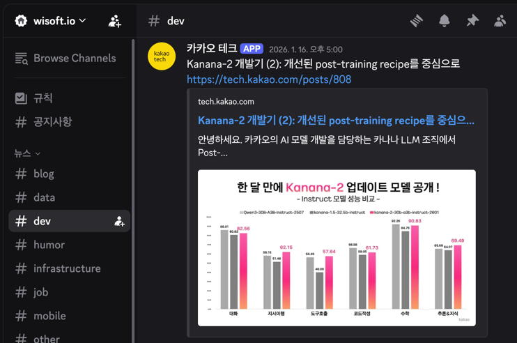

# Dev News Bot (연구실 개발 뉴스 알림 봇)

이 프로젝트는 RSS 피드를 주기적으로 확인하여 새로운 개발 뉴스나 기술 블로그 포스트를 Discord 채널에 자동으로 전송해주는 봇입니다.

## 주요 기능

- **RSS 피드 구독**: 지정된 RSS URL에서 최신 정보를 가져옵니다.
- **자동 알림**: `node-cron`을 사용하여 매일 정해진 시간(오전 5시 KST)에 어제의 소식을 확인하고 전송합니다.
- **Discord 통합**: `discord.js`를 통해 지정된 채널로 소식을 공유합니다.

## 기술 스택

- **Runtime**: [Bun](https://bun.sh)
- **Language**: TypeScript
- **Library**: 
  - `discord.js`: Discord API 연동
  - `rss-parser`: RSS 데이터 파싱
  - `node-cron`: 주기적 작업 예약 (Cron Job)
  - `dotenv`: 환경 변수 관리

## 설정 방법

프로젝트 루트 디렉토리에 `.env` 파일을 생성하고 다음 변수들을 설정해야 합니다.

```env
BOT_TOKEN=your_discord_bot_token
CHANNEL_ID=your_discord_channel_id
RSS_FEED_URL=your_rss_feed_url
```

## 설치 및 실행

### 1. 의존성 설치

```bash
bun install
```

### 2. 봇 실행

```bash
bun start
```

또는 직접 진입점을 지정하여 실행할 수 있습니다:

```bash
bun run src/app.init.ts
```

## 프로젝트 구조

- `src/app.init.ts`: 봇의 진입점 및 Discord 클라이언트 초기화
- `src/rss_parser/rssFeedParser.ts`: RSS 피드를 파싱하고 어제의 글을 필터링하는 로직
- `src/utils/cron.ts`: 크론 잡 스케줄링 설정

## 실행 화면



